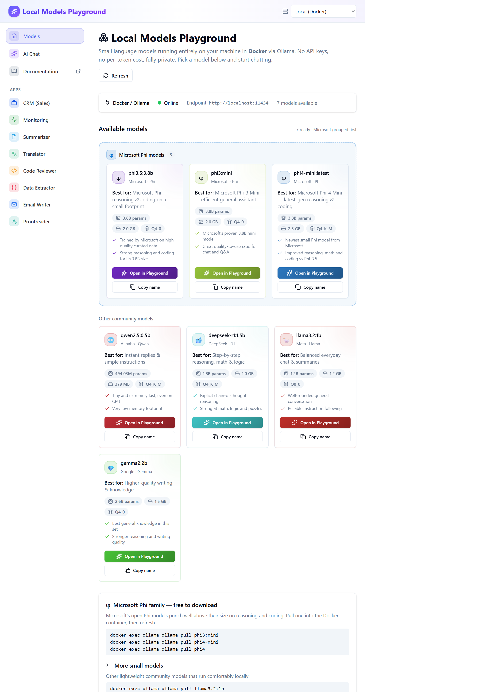
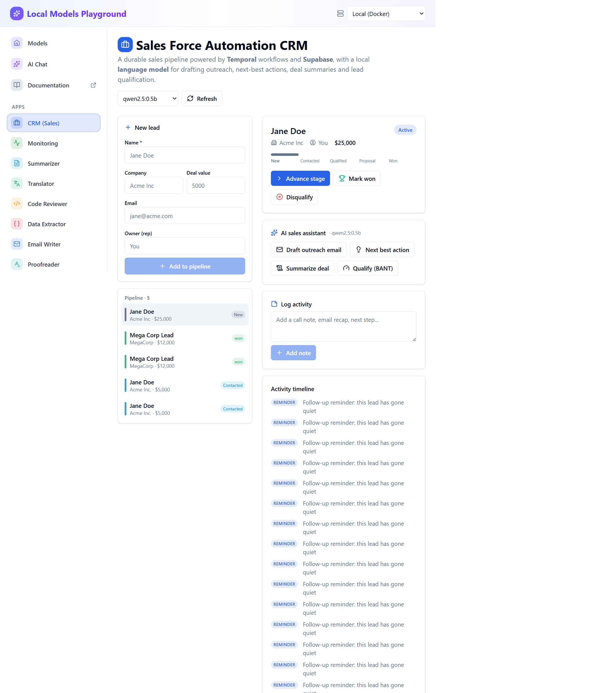
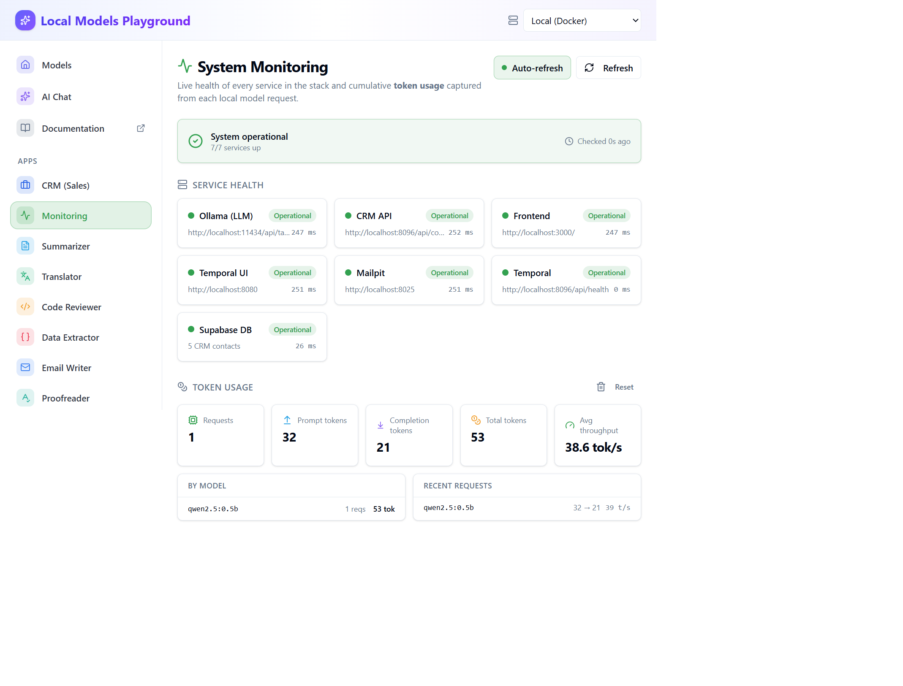
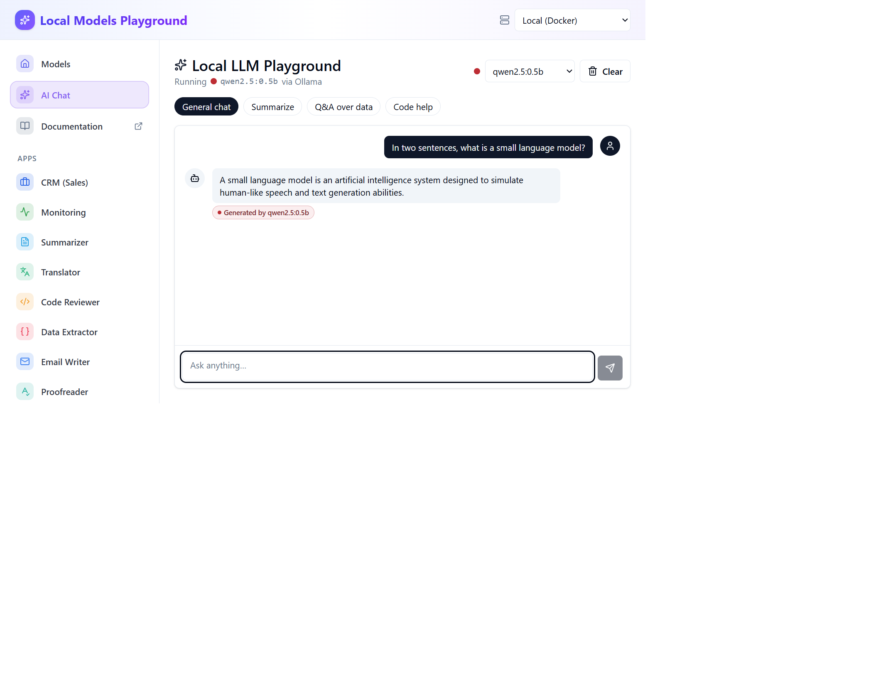

# Boilerplate Stack

Phase 1 scaffolding for the JSON-driven Supabase + Temporal starter.

## Screenshots

A live walkthrough of the running stack (`docker compose up -d`), captured from the deployment at http://localhost:3000.

### Local Models Playground
Small language models served locally in Docker. Models are grouped with the Microsoft Phi family first, each card showing parameters, on-disk size, quantization and "best for" guidance.



### Sales Force Automation CRM
A durable sales pipeline where every lead is a long-running **Temporal** workflow persisted to **Supabase**, with the local language model layered on top for drafting outreach, suggesting the next best action, summarizing deals and qualifying leads (BANT).



### AI-Driven Selling + model efficiency calculator
Inside each lead, a dedicated **AI-Driven Selling** panel uses the local model to **build the deal** (discovery questions, value pitch, BANT, next best action) and **close the deal** (handle objections, draft proposal, closing email, close plan). The built-in **model efficiency calculator** benchmarks the same task across models and recommends the best one by *effective throughput* (completion tokens ÷ total time).


### System Monitoring
Live health for every service in the stack (Ollama, CRM API, Frontend, Temporal, Mailpit, Supabase DB) plus cumulative **token usage** captured from each local model request — totals, per-model breakdown and throughput.



### AI Chat
Streaming chat against any locally pulled model, with a model picker, stop control and copy/error states.



### Verdict Markets — YES/NO event contracts
Ask a yes/no question about any future event and the local model prices it as a **YES/NO contract** — implied probability, YES/NO cent prices, news context, the drivers behind the price and what could move it (research and entertainment only — not financial advice).


### Predikt — multi-outcome prediction market
Describe a real-world event and the local model returns a **prediction market** — a single "% chance" with Buy Yes / Buy No for binary questions, or a ranked list of outcomes (each with Yes/No cents) for "who/which" questions, plus volume and the reasoning behind the odds (research and entertainment only — not financial advice).


## Apps

Once the stack is running, open **http://localhost:3000** and pick an app from the left sidebar. Every app runs against the local models — no API keys, no per-token cost, fully private.

### Core

| App | Route | What it does |
| --- | --- | --- |
| **Local Models Playground** | `/` | Gallery of every model installed locally — parameters, on-disk size, quantization and "best for" guidance, grouped with Microsoft Phi first. |
| **AI Chat** | `/chat` | Streaming chat against any installed model, with a model picker, stop control, and copy/error states. |

### Text & code tools

| App | Route | What it does |
| --- | --- | --- |
| **Summarizer** | `/apps/summarizer` | Condense long text into clear bullet points. |
| **Translator** | `/apps/translator` | Translate text into another language. |
| **Code Reviewer** | `/apps/code-reviewer` | Review code for bugs, edge cases, security issues and improvements. |
| **Data Extractor** | `/apps/extractor` | Turn unstructured text (emails, invoices, notes) into structured JSON. |
| **Email Writer** | `/apps/email-writer` | Turn a few notes into a polished email. |
| **Proofreader** | `/apps/proofreader` | Fix grammar, spelling and punctuation. |
| **Tone Rewriter** | `/apps/rewriter` | Rewrite text in a different tone or style. |
| **Brainstormer** | `/apps/brainstorm` | Generate fresh ideas around any topic. |
| **Explainer** | `/apps/explain` | Explain any concept at the level you choose. |
| **SQL Generator** | `/apps/sql` | Turn a plain-English request into a SQL query. |
| **JSON Builder** | `/apps/json-builder` | Describe the data you need and get well-formed JSON. |
| **Azure Architecture Advisor** | `/apps/azure-architecture` | Assess a workload through the Azure Well-Architected Framework. |

### Prediction markets

Faithful clones of the leading prediction-market exchanges, priced entirely by a local model (research and entertainment only — not financial advice).

| App | Route | What it does |
| --- | --- | --- |
| **Verdict Markets** | `/apps/verdict` | A YES/NO event-contract exchange: turn an event question into a contract with cent prices, an implied-probability bar, news context, drivers and catalysts. |
| **Predikt** | `/apps/predikt` | A multi-outcome prediction market: a "% chance" donut with Buy Yes / Buy No for binary questions, or a ranked multi-outcome list with per-outcome Yes/No cents, volume and reasoning. |

### Business apps

Department-focused assistants that show where a local SLM fits into everyday business workflows.

| App | Route | Department | What it does |
| --- | --- | --- | --- |
| **Meeting Assistant** | `/apps/meeting-notes` | Operations | Turn raw meeting notes or a transcript into a summary, decisions and owner-assigned action items. |
| **Support Reply Assistant** | `/apps/support-reply` | Customer Support | Draft clear, empathetic, ready-to-send replies to customer messages. |
| **Job Description Writer** | `/apps/job-description` | HR | Generate a complete, inclusive job description from a few role details. |
| **Resume Screener** | `/apps/resume-screener` | Recruiting | Score a candidate against a job description and surface strengths, gaps and interview questions. |
| **Ad Copy Generator** | `/apps/ad-copy` | Marketing | Produce headlines, ad descriptions and calls to action from product or campaign details. |
| **Contract Clause Analyzer** | `/apps/contract-analyzer` | Legal | Explain contract clauses in plain English and flag risky or unusual terms (informational only — not legal advice). |
| **Financial Report Summarizer** | `/apps/finance-summary` | Finance | Condense earnings text or figures into an executive summary, key metrics and risks (informational only — not financial advice). |
| **Customer Review Analyzer** | `/apps/review-analyzer` | Customer Insights | Turn customer reviews into sentiment, recurring themes and concrete actions. |

### Full-stack apps (Temporal + Supabase)

| App | Route | What it does |
| --- | --- | --- |
| **CRM (Sales Force Automation)** | `/apps/crm` | A durable sales pipeline where each lead is a long-running **Temporal** workflow persisted to **Supabase**, with an **AI-Driven Selling** panel that uses the local model to build and close the deal (discovery, value pitch, BANT, objections, proposal, closing email, close plan) and a **model efficiency calculator** that benchmarks models to pick the best one per use case. |
| **System Monitoring** | `/apps/monitor` | Live health for every service (Ollama, CRM API, Frontend, Temporal, Mailpit, Supabase DB) plus cumulative **token usage** captured from every model request, broken down per model. |

## How to use

### Text, code & business apps
1. Open the app from the left sidebar.
2. Choose a model from the **model dropdown** (defaults to `qwen2.5:0.5b`; larger Phi/Gemma/Llama models give stronger results).
3. Paste or type your input in the left panel.
4. Click the action button (e.g. **Summarize**, **Translate**, **Review**, **Draft reply**, **Screen candidate**) — the response streams in on the right.
5. Use **Stop** to cancel, **Copy** to grab the output, then tweak the input and re-run.

> Tip: the **Resume Screener** takes a job description and a resume in the same box — paste the job description, then a line with `---`, then the resume.

### CRM (full-stack)
1. Open **CRM (Sales)**. The CRM API (`crm-web`), Temporal and Supabase start automatically with `docker compose up -d`.
2. Add a lead in **New lead** → this starts a durable `CrmLeadWorkflow` in Temporal, persisted to Supabase.
3. Click a lead to open it, then drive the pipeline with **Advance / Mark won / Disqualify** (these are Temporal signals) — `New → Contacted → Qualified → Proposal → Won`.
4. In the **AI-Driven Selling** panel, pick a model and run **Build the deal** actions (Discovery questions, Value pitch, Qualify BANT, Next best action) or **Close the deal** actions (Handle objections, Draft proposal, Closing email, Close plan, Outreach email, Summarize deal). Each result streams in and can be **saved to the durable timeline**.
5. Use the **model efficiency calculator**: choose a use case, select the models to compare, and click **Run efficiency test** — it ranks models by effective throughput (completion tokens ÷ total time) and crowns the best one, with a one-click **Use it** to switch to it.

### System Monitoring
1. Open **Monitoring** to see every service's status and latency; toggle **Auto-refresh** for 10s polling.
2. **Token usage** accrues automatically as you use any app — totals, per-model prompt/completion split and throughput. Use **Reset** to clear local counters.

## Prerequisites
- Docker Desktop with Compose v2
- `make` (comes with macOS/Linux; install via Xcode CLT on macOS)
- Node 18+ (optional for running the frontend outside Docker)
- Supabase CLI (optional) if you want the full Supabase stack locally

## Quick Start
1) Copy environment defaults  
   `cp .env.example .env`
2) Start everything  
   `make up`  
   (add `USE_DEV=1` for live-reload mounts)
3) Open services  
   - Frontend placeholder: http://localhost:3000  
   - Temporal UI: http://localhost:8080  
   - Temporal gRPC: localhost:7234  
   - Supabase Postgres stub: localhost:55432

Common commands:
- `make down` — stop containers
- `make reset` — tear down volumes and recreate containers
- `make logs` — stream all service logs
- `make logs-temporal` / `make logs-frontend` — targeted logs

## Deployment

End-to-end instructions for running the stack with Docker Compose, grouped by
platform — **Linux / macOS**, **Windows**, and **Azure** (cloud). For the full
step-by-step walkthrough see [docs/DEPLOYMENT.md](docs/DEPLOYMENT.md); for SLM
architecture and the API reference see [docs/SLM.md](docs/SLM.md).

### Prerequisites

| Tool | Version (min) | Used for | Check |
| --- | --- | --- | --- |
| Docker Desktop / Engine | 24+ | Local containers | `docker --version` |
| Docker Compose | v2 | Orchestration | `docker compose version` |
| `make` | any | Lifecycle shortcuts (optional) | `make --version` |
| Node | 18+ | Running the frontend outside Docker (optional) | `node --version` |
| Azure CLI | 2.50+ | Cloud deployment (optional) | `az version` |
| Bicep | bundled with Azure CLI | IaC templates | `az bicep version` |
| GitHub CLI | 2.0+ | Repo management (optional) | `gh --version` |

- An **Azure subscription** with rights to create resource groups and Container Instances (only for cloud deploy).
- **~4 GB free RAM** for the default model on CPU; more for larger Phi/Gemma/Llama models.
- Ports listed below must be free on the host.

### Service ports

| Service | URL / Port | Purpose |
| --- | --- | --- |
| Frontend | http://localhost:3000 | React app (playground, chat, all apps) |
| Ollama | http://localhost:11434 | Local model server (`OLLAMA_ORIGINS=*`) |
| CRM API | http://localhost:8096 | FastAPI for the CRM app (`/api/health`) |
| Showcase | http://localhost:8090 | Static SLM showcase (`/slm.html`) |
| Temporal UI | http://localhost:8080 | Workflow dashboard |
| Temporal gRPC | localhost:7234 | Worker/client endpoint |
| Supabase Postgres | localhost:55432 | App database |
| Mailpit | http://localhost:8025 | Email UI (SMTP on `:1025`) |
| Mailer | http://localhost:8200 | Mailer service |
| Chess / game-web | http://localhost:8095 | Demo game app |

### Deploy on Linux / macOS (Docker)

Use any terminal (bash/zsh). Requires Docker Engine + Compose v2 (and optionally `make`).

1. **Clone and enter the repo:**

   ```bash
   git clone https://github.com/KrishnaDistributedcomputing/local-slm-playground.git
   cd local-slm-playground
   ```

2. **Copy environment defaults:**

   ```bash
   cp .env.example .env
   ```

3. **Start the full stack:**

   ```bash
   docker compose up -d          # start everything
   # or: make up                 # (add USE_DEV=1 for live-reload mounts)
   ```

   Start only the SLM services (server + default model pull + showcase):

   ```bash
   docker compose up -d ollama ollama-pull showcase
   docker compose logs -f ollama-pull   # wait for "success" — model is ready
   ```

4. **Open the app** at **http://localhost:3000** and the **Monitoring** app (`/apps/monitor`) to confirm every service is healthy.

### Deploy on Windows (Docker Desktop + WSL2)

The stack runs on Windows 10/11 through Docker Desktop. All commands below use **PowerShell** (the included Azure script is already PowerShell-native).

1. **Enable WSL2** (one-time, in an **admin** PowerShell, then reboot):

   ```powershell
   wsl --install
   wsl --set-default-version 2
   ```

2. **Install Docker Desktop** and enable the WSL2 backend:
   - Download from https://www.docker.com/products/docker-desktop/ (or `winget install Docker.DockerDesktop`).
   - In **Settings → General**, tick **Use the WSL 2 based engine**.
   - In **Settings → Resources → WSL Integration**, enable your distro.
   - Start Docker Desktop and wait until the whale icon shows **Engine running**.

3. **Install Git and clone the repo** (or `winget install Git.Git`):

   ```powershell
   git clone https://github.com/KrishnaDistributedcomputing/local-slm-playground.git
   cd local-slm-playground
   ```

4. **Create the env file** (PowerShell has no `cp`; use `Copy-Item`):

   ```powershell
   Copy-Item .env.example .env
   ```

5. **Start the full stack** (`make` is not on Windows by default — call Docker Compose directly):

   ```powershell
   docker compose up -d
   ```

   The first run pulls images and the default model (`qwen2.5:0.5b`); give it a few minutes. Watch the model download with:

   ```powershell
   docker compose logs -f ollama-pull   # wait for "success", then Ctrl+C
   ```

6. **Open the app** at **http://localhost:3000** and the **Monitoring** app (`/apps/monitor`) to confirm every service is healthy.

To deploy the SLM to the cloud from Windows, see **Deploy on Azure (Container Instances)** below — the bundled `scripts/deploy-azure.ps1` is PowerShell-native.

**Windows tips**
- **`make` (optional):** install with `winget install GnuWin32.Make` or `choco install make`, or just use the `docker compose …` commands shown throughout this guide.
- **Run inside the project folder.** If a path has spaces, keep the commands as-is (PowerShell handles the current directory) or wrap paths in quotes.
- **Ports:** if `port is already allocated`, find the process with `Get-NetTCPConnection -LocalPort 3000` (or 11434/8096/8080/55432…) and stop it, or change the mapping in `docker-compose.yml`.
- **Performance:** give Docker Desktop enough memory in **Settings → Resources** (≥ 4 GB for the default model; more for larger Phi/Gemma/Llama models). Keep the repo on the Windows filesystem (e.g. `C:\…`) when using Docker Desktop's WSL2 integration.
- **Line endings:** Git may warn `LF will be replaced by CRLF` — this is harmless. Shell scripts run inside Linux containers regardless.

### Deploy on Azure (Container Instances)

Push the SLM to **Azure Container Instances (ACI)** so the playground and every app can call a cloud endpoint. Requires the **Azure CLI** (`az`) and an Azure subscription. The script is PowerShell and works on both Windows and Linux/macOS (with PowerShell 7).

```powershell
az login
./scripts/deploy-azure.ps1                                   # default model set
# custom set:
./scripts/deploy-azure.ps1 -Models 'qwen2.5:0.5b','llama3.2:1b'
```

The script creates the resource group, deploys the Bicep template under
`infra/azure/`, and prints the public **Ollama endpoint URL**. In the app's
**header endpoint selector**, choose **+ Add Azure endpoint…** and paste
`http://<fqdn>:11434` to point the playground and every app at the cloud
deployment.

Remove the cloud resources when you're done:

```powershell
az group delete --name rg-slm-ollama --yes --no-wait
```

### Common operations (all platforms)

**Verify the stack**

```bash
docker compose ps                     # all services Up / healthy
docker exec ollama ollama list        # installed models
curl http://localhost:11434/api/generate -d '{
  "model": "qwen2.5:0.5b",
  "prompt": "Say hello in one short sentence.",
  "stream": false
}'
curl http://localhost:8096/api/health # CRM API + Temporal + Supabase status
```

Then open the app at **http://localhost:3000** and the **Monitoring** app
(`/apps/monitor`) to confirm every service is reporting healthy.

**Add or switch models** — new models appear automatically in the model pickers and the gallery.

```bash
docker exec ollama ollama pull phi4-mini:latest
docker exec ollama ollama pull gemma2:2b
```

### Rebuilding after changes

- **Frontend** changes (anything under `frontend/`): `docker compose up -d --build frontend`
- **CRM API** changes (`temporal/src/crm_api.py`): `docker compose up -d --build crm-web`
- **Showcase** changes: `docker compose build --no-cache showcase && docker compose up -d --force-recreate showcase`
- **Docs / README only:** no rebuild needed.

### Tear down

```bash
docker compose down                      # stop containers
docker compose down -v                   # also remove volumes (deletes pulled models + DB)
az group delete --name rg-slm-ollama --yes --no-wait   # remove Azure resources (cloud deploy)
```

### Troubleshooting

| Symptom | Likely cause | Fix |
| --- | --- | --- |
| `port is already allocated` | A host port (3000, 11434, 8096, 8080, 55432…) is in use | Stop the conflicting process or change the mapping in `docker-compose.yml` |
| Frontend shows `ERR_EMPTY_RESPONSE` / blank | Vite still starting after a rebuild | Wait a few seconds for the container to be ready, then reload |
| `model not found` | Model not pulled yet | `docker exec ollama ollama pull <model>` or wait for the boot pull |
| Chat/app can't reach the model | Wrong endpoint or CORS | Confirm the endpoint selector; ensure `OLLAMA_ORIGINS=*` on the `ollama` service |
| Slow first response | Model loading into memory | Wait; subsequent calls are faster |
| CRM app shows no data / errors | `crm-web`, Temporal or Supabase not up | `docker compose ps`; check `docker compose logs crm-web temporal-worker supabase-db` |
| Monitoring shows a service **down** | That container is unhealthy | Inspect its logs: `docker compose logs <service>` |
| Out of memory | Model too large for host/ACI | Use a smaller model or raise `memoryInGb` in `main.bicepparam` |
| Azure 404 / no response | Models still downloading on boot | Wait 1–3 min; `az container logs --resource-group rg-slm-ollama --name slm-ollama` |
| Showcase shows old content | Stale Docker image | `docker compose build --no-cache showcase && docker compose up -d --force-recreate showcase` |

## Local & Cloud SLM (Ollama)
A GPT‑style small language model runs locally in Docker and can be deployed to Azure.
- **Server:** `ollama` service on http://localhost:11434 (default model `qwen2.5:0.5b`; also `llama3.2:1b`, `gemma2:2b`)
- **Showcase UI:** http://localhost:8090/slm.html — live streaming demo with endpoint + model dropdowns
- **Cloud:** Bicep IaC under `infra/azure/` deploys Ollama to Azure Container Instances

Quick start:
```bash
docker compose up -d ollama ollama-pull   # start server + pull default model
```
See [docs/SLM.md](docs/SLM.md) for full architecture, model management, Azure deployment, API reference, and troubleshooting.
For a step‑by‑step local + Azure deployment walkthrough, see [docs/DEPLOYMENT.md](docs/DEPLOYMENT.md).

## What’s Included (Phase 1)
- Docker Compose stack with Temporal server, UI, worker, frontend dev server, and stub Supabase Postgres
- Development overrides in `docker-compose.dev.yml` for live-reloading frontend and worker code
- Makefile wrappers for the usual lifecycle commands
- `.env.example` capturing required variables for frontend, Temporal, and Supabase placeholders

## Notes
- Supabase services are intentionally stubbed for Phase 1; use `supabase start --config supabase/config.toml` when you need the full Supabase stack.
- Frontend and Temporal code are minimal placeholders to keep containers healthy; replace with real implementations in Phases 2–3.
