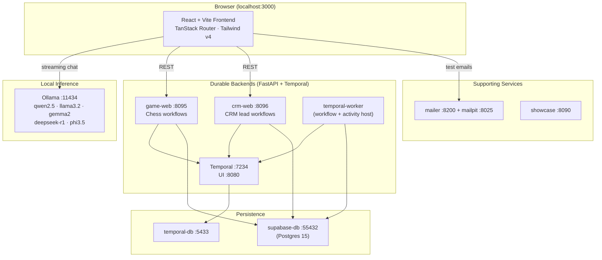

# Local Models Playground — Detailed Project Document

A fully local, privacy-first AI playground that runs small language models (SLMs)
on your own machine via [Ollama](https://ollama.com), wrapped in a modern React
frontend and backed by durable [Temporal](https://temporal.io) workflows with
[Supabase](https://supabase.com) (Postgres) persistence. Everything runs in
Docker Compose — **nothing leaves your machine**.

- **Repository:** `KrishnaDistributedcomputing/slm-ollama-stack`
- **Stack:** React + Vite + TanStack Router + Tailwind v4 · Ollama · Temporal · Supabase/Postgres · FastAPI · Docker Compose
- **Status:** Active development

---

## Table of Contents

1. [What This Is](#1-what-this-is)
2. [System Architecture](#2-system-architecture)
3. [Services & Ports](#3-services--ports)
4. [The Frontend Playground](#4-the-frontend-playground)
5. [App Catalog (14 mini-apps)](#5-app-catalog-14-mini-apps)
6. [The Models](#6-the-models)
7. [Durable Backends: Chess & CRM](#7-durable-backends-chess--crm)
8. [Supporting Services](#8-supporting-services)
9. [Azure Infrastructure](#9-azure-infrastructure)
10. [Getting Started](#10-getting-started)
11. [Development Workflow](#11-development-workflow)
12. [Repository Layout](#12-repository-layout)
13. [Troubleshooting](#13-troubleshooting)

---

## 1. What This Is

The Local Models Playground is a teaching and demo environment that shows how
far small, locally-hosted language models can go. It bundles:

- A **model gallery** that introduces each installed SLM, with curated
  strengths/weaknesses so users can pick the right model for a task.
- A streaming **AI Chat** against any local model.
- **14 single-purpose mini-apps** (summarizer, translator, code reviewer,
  prediction-market analysts, etc.) — each is just a system prompt and a few
  labels on top of one shared, reusable shell.
- Two **durable backend demos** built on Temporal + Supabase: a multiplayer
  **chess** server and a small **CRM** that models a sales pipeline as a
  long-running workflow.
- Supporting infrastructure: a local mail capture service, a static showcase
  site, and Azure deployment templates.

Design principles:

- **Local-first / private** — model inference never leaves the host. The browser
  talks directly to Ollama (`OLLAMA_ORIGINS=*` in dev).
- **Durable state lives in workflows** — Temporal owns the source of truth for
  long-running processes; Postgres is the persistence layer.
- **One shell, many apps** — every text mini-app reuses `TextToolApp`, so a new
  app is typically a ~25-line route file.

---

## 2. System Architecture



**Key flows**

- **Chat / Apps:** the browser streams tokens directly from Ollama's
  `/api/chat`. No server sits in the middle — the React app handles streaming,
  stop, copy, and error states.
- **Durable demos:** the browser calls a FastAPI service (`game-web` /
  `crm-web`) over REST. The API translates HTTP into Temporal **signals** and
  **queries**. The `temporal-worker` executes workflow code and activities;
  activities persist to Supabase Postgres via `psycopg2`.

---

## 3. Services & Ports

All services are defined in [docker-compose.yml](../docker-compose.yml).

| Service | Container | Host Port | Purpose |
|---|---|---|---|
| Frontend | `frontend` | `3000` | React playground (Vite dev server) |
| Ollama | `ollama` | `11434` | Local model inference API |
| Ollama pull | `ollama-pull` | — | One-shot: pulls `qwen2.5:0.5b` + `phi3.5:3.8b` |
| Chess API | `game-web` | `8095` | FastAPI → Temporal chess workflows |
| CRM API | `crm-web` | `8096` | FastAPI → Temporal CRM lead workflows |
| Temporal worker | `temporal-worker` | — | Hosts workflow + activity code |
| Temporal | `temporal` | `7234` | Temporal frontend (gRPC `7233` inside) |
| Temporal UI | `temporal-ui` | `8080` | Workflow inspection web UI |
| Supabase DB | `supabase-db` | `55432` | App Postgres (state persistence) |
| Temporal DB | `temporal-db` | `5433` | Temporal's own Postgres |
| Mailpit | `mailpit` | `1025` / `8025` | SMTP sink + web UI for test email |
| Mailer | `mailer` | `8200` | FastAPI mail-sending helper |
| Showcase | `showcase` | `8090` | Static marketing/demo site |

---

## 4. The Frontend Playground

**Location:** [frontend/](../frontend) · **Tech:** React 18, TypeScript, Vite
5.4, TanStack Router (file-based routing), Tailwind CSS v4, shadcn/ui,
lucide-react.

### Layout

- **Root shell** — [frontend/src/routes/__root.tsx](../frontend/src/routes/__root.tsx)
  renders the header (model-endpoint switcher), a left sidebar with the nav
  (Models, AI Chat, the Apps list, and a "Which model should I use?" guide), and
  the routed content area.
- **Routing** — file-based. Each file under `src/routes/` becomes a route;
  `routeTree.gen.ts` is generated automatically by the `TanStackRouterVite`
  plugin when Vite runs.
- **Model endpoint switcher** — defaults to Local (Docker) Ollama; supports
  adding an Azure endpoint.

### The shared shell: `TextToolApp`

**Location:** [frontend/src/components/TextToolApp.tsx](../frontend/src/components/TextToolApp.tsx)

Every text mini-app is a thin wrapper around `TextToolApp`, a reusable
"input → model → output" shell that handles:

- The **model picker** (populated from Ollama's `/api/tags`) with a live status
  dot per model.
- **Streaming** responses with a stop button, a copy button, an input character
  counter, and error display.
- A modern Tailwind v4 look: a glassy header card with an accent-tinted icon
  badge and soft glow, gradient title, elevated rounded cards with hover lift,
  accent label bars, and a gradient run button with press feedback.

It exposes a small, declarative props API:

| Prop | Purpose |
|---|---|
| `title`, `description`, `icon` | Header content |
| `system` | The system prompt that defines the app's behavior |
| `inputLabel`, `placeholder` | Input box config |
| `runLabel`, `outputLabel` | Button + output labels |
| `controls` | Optional extra controls (e.g. a target-language selector) |
| `buildUserContent` | Optionally transform the raw input before sending |
| `accent` | Optional brand accent color (hex) for the icon + run button |

A new app is therefore just a route file that supplies a prompt and labels —
see [Section 5](#5-app-catalog-14-mini-apps).

---

## 5. App Catalog (14 mini-apps)

All apps live under [frontend/src/routes/apps/](../frontend/src/routes/apps) and
appear in the sidebar's **Apps** section.

| App | Route | Icon | What it does |
|---|---|---|---|
| Summarizer | `/apps/summarizer` | — | Condenses long text into key points |
| Translator | `/apps/translator` | — | Translates between languages (target selector) |
| Code Reviewer | `/apps/code-reviewer` | `Code2` | Reviews code for bugs and improvements |
| Data Extractor | `/apps/extractor` | `Braces` | Pulls structured data from free text |
| Email Writer | `/apps/email-writer` | `Mail` | Drafts emails from a brief |
| Proofreader | `/apps/proofreader` | — | Fixes grammar and clarity |
| Tone Rewriter | `/apps/rewriter` | — | Rewrites text in a chosen tone |
| Brainstormer | `/apps/brainstorm` | `Lightbulb` | Generates ideas around a topic |
| Explainer | `/apps/explain` | `GraduationCap` | Explains concepts simply |
| SQL Generator | `/apps/sql` | — | Turns questions into SQL |
| JSON Builder | `/apps/json-builder` | `FileJson` | Produces structured JSON from a description |
| Azure Architecture Advisor | `/apps/azure-architecture` | `CloudCog` | Advises using the Well-Architected Framework's 5 pillars |
| Polymarket Analyst | `/apps/polymarket` | `CircleDollarSign` | Estimates YES/NO market odds, Polymarket-style (blue accent `#1652F0`) |
| Kalshi Analyst | `/apps/kalshi` | `CandlestickChart` | Prices event contracts in cents, Kalshi-style (mint accent `#00D09C`) |

### Spotlight: prediction-market analysts

**Polymarket Analyst** ([polymarket.tsx](../frontend/src/routes/apps/polymarket.tsx))
restates an event as a YES/NO resolution question, gives an estimated YES
probability with implied **dollar share prices** (e.g. `YES $0.62 / NO $0.38`),
lists key drivers, and notes edge & uncertainty.

**Kalshi Analyst** ([kalshi.tsx](../frontend/src/routes/apps/kalshi.tsx))
reframes an event as a verifiable contract, prices YES/NO in **cents that sum to
100**, gives base-rate rationale, and lists upcoming catalysts.

Both carry the disclaimer: *"Not financial advice — for research and
entertainment only."* and are for research/education, not trading.

---

## 6. The Models

Profiles are curated in
[frontend/src/data/modelProfiles.ts](../frontend/src/data/modelProfiles.ts) and
surfaced in the "Which model should I use?" guide. Profiles are keyed by base
model name with a keyword fallback.

| Model | Size | Best for | Notes |
|---|---|---|---|
| `qwen2.5:0.5b` *(default)* | 0.5B | Instant replies & simple instructions | Tiny, fast on CPU, multilingual; limited reasoning |
| `llama3.2:1b` | 1B | Balanced everyday chat & summaries | Reliable instruction-following; weaker at math/code |
| `gemma2:2b` | 2B | Higher-quality writing & knowledge | Best general knowledge here; slowest/most RAM |
| `deepseek-r1:1.5b` | 1.5B | Step-by-step reasoning, math & logic | Explicit chain-of-thought; verbose `<think>` output |
| `phi3.5:3.8b` | 3.8B | Microsoft Phi — reasoning & coding | Curated training, 128K context; heavier footprint |

On first start, `ollama-pull` automatically pulls `qwen2.5:0.5b` and
`phi3.5:3.8b` into the shared `ollama-data` volume. Additional models can be
pulled with `docker exec ollama ollama pull <model>`.

---

## 7. Durable Backends: Chess & CRM

Both demos share one pattern, mirrored from the chess app:

> **HTTP (FastAPI) → Temporal signal/query → Workflow (source of truth) →
> Activity (psycopg2) → Supabase Postgres**

Workflows own state and survive restarts; the database is the durable
projection. All workflow + activity code lives in [temporal/](../temporal) and
is registered in [temporal/src/worker.py](../temporal/src/worker.py).

### Chess (`game-web` :8095)

A multiplayer chess server. Each game is a Temporal workflow; moves arrive as
signals; the current board is read via a query. The UI is a dark-themed vanilla
SPA served by FastAPI.

### Mini CRM (`crm-web` :8096)

A small sales-pipeline CRM where **each lead is a long-running workflow**.

- **Workflow:** `CrmLeadWorkflow`
  ([crm_workflow.py](../temporal/src/workflows/example/crm_workflow.py)) with
  stages `New → Contacted → Qualified → Proposal → Won`.
  - **Signals:** `advance`, `set_stage`, `add_note`, `win`, `disqualify`.
  - **Query:** `state` returns the full lead snapshot.
  - **Durable timer:** a follow-up reminder fires via
    `workflow.wait_condition(..., timeout=...)`, recorded to the timeline.
  - On every change the run loop durably syncs new notes to Supabase in order
    (`created`, stage changes, notes, reminders, won/lost).
- **Activities:** [crm_store.py](../temporal/src/activities/crm_store.py) —
  `upsert_contact`, `record_activity`, `list_contacts`, `get_activities`.
  Auto-creates `crm_contacts` and `crm_activities` tables on first use.
- **API:** [crm_api.py](../temporal/src/crm_api.py) — `GET/POST /api/contacts`,
  `GET /api/contacts/{id}`, and `POST .../advance|stage|note|win|disqualify`.
- **UI:** [crm.html](../temporal/src/static/crm.html) — a dark-themed Kanban
  pipeline with a new-lead form, a detail panel (stage steps, fields, action
  buttons, note box), and an activity timeline. Polls every ~4s.

---

## 8. Supporting Services

- **Mailpit + Mailer** — Mailpit captures all outbound SMTP locally (web UI at
  `:8025`); the [mailer](../mailer) FastAPI service (`:8200`) sends test emails
  into it. Lets the frontend demo email flows without touching the internet.
- **Showcase** — a static site ([showcase/](../showcase)) served on `:8090`,
  including an `slm.html` landing page.

---

## 9. Azure Infrastructure

Deployment templates live in [infra/azure/](../infra/azure):

- [main.bicep](../infra/azure/main.bicep) — infrastructure as Bicep.
- [main.bicepparam](../infra/azure/main.bicepparam) — parameters.
- [scripts/deploy-azure.ps1](../scripts/deploy-azure.ps1) — deployment helper.

A suggested resource group for testing is `rg-slm-ollama` in `eastus`. See
[docs/DEPLOYMENT.md](DEPLOYMENT.md) for details.

---

## 10. Getting Started

### Prerequisites

- Docker Desktop (with Compose v2)
- ~6–8 GB free RAM recommended for the larger models

### Run everything

```powershell
# From the repository root
docker compose up -d --build
```

First start pulls the default models (a few minutes). Then open:

| URL | What |
|---|---|
| http://localhost:3000 | The playground (Models, Chat, Apps) |
| http://localhost:8096 | CRM demo |
| http://localhost:8095 | Chess demo |
| http://localhost:8080 | Temporal UI |
| http://localhost:8090/slm.html | Showcase |
| http://localhost:8025 | Mailpit inbox |

### Stop / reset

```powershell
docker compose down            # stop containers
docker compose down -v         # stop and remove volumes (wipes models + data)
```

---

## 11. Development Workflow

### Frontend changes require a container rebuild

The frontend Dockerfile **bakes the source** (`COPY . .`) and runs
`npm run dev` — there is **no bind mount**. After editing any frontend file:

```powershell
docker compose up -d --build frontend
```

Vite is typically ready 2–4 seconds after the container starts. Navigations
during the rebuild window return `ERR_EMPTY_RESPONSE`; reload once Vite is ready.

### Adding a new mini-app

1. Create `frontend/src/routes/apps/<name>.tsx` that renders `<TextToolApp>`
   with a `system` prompt, labels, an icon, and (optionally) an `accent` color.
2. Add a sidebar `<Link>` (and icon import) in
   [__root.tsx](../frontend/src/routes/__root.tsx).
3. Rebuild the frontend container. The route tree regenerates inside the
   container; sync it back for host type-checking if needed:

   ```powershell
   docker cp frontend:/app/src/routeTree.gen.ts ./frontend/src/routeTree.gen.ts
   ```

### Adding a model profile

Add an entry to `PROFILES` in
[modelProfiles.ts](../frontend/src/data/modelProfiles.ts), keyed by the base
model name, then pull the model into Ollama.

---

## 12. Repository Layout

```
project-template-main/
├── docker-compose.yml          # All services
├── frontend/                   # React + Vite playground
│   └── src/
│       ├── routes/             # File-based routes
│       │   ├── __root.tsx      # Shell + sidebar nav
│       │   └── apps/           # The 14 mini-apps
│       ├── components/
│       │   └── TextToolApp.tsx # Shared app shell
│       ├── data/
│       │   ├── ollama.ts       # Streaming client + model list
│       │   └── modelProfiles.ts# Curated model strengths/weaknesses
│       └── lib/modelColors.ts  # Per-model accent colors
├── temporal/                   # Workflows, activities, FastAPI APIs
│   └── src/
│       ├── worker.py           # Registers workflows + activities
│       ├── web_api.py          # Chess API (game-web)
│       ├── crm_api.py          # CRM API (crm-web)
│       ├── workflows/          # Workflow definitions
│       ├── activities/         # Supabase-persisting activities
│       └── static/             # crm.html and chess UI
├── mailer/                     # Test-email FastAPI helper
├── showcase/                   # Static demo site
├── supabase/                   # Migrations, seed, config
├── infra/azure/                # Bicep IaC
├── scripts/deploy-azure.ps1    # Azure deploy helper
└── docs/                       # This document and others
```

---

## 13. Troubleshooting

| Symptom | Cause / Fix |
|---|---|
| Frontend shows `ERR_EMPTY_RESPONSE` | Container is mid-rebuild; wait for Vite, then reload |
| Model picker stuck on "Checking…" | Transient React Query state during rebuild; reload once Ollama is up |
| New route not found / type errors | Rebuild frontend, then `docker cp` `routeTree.gen.ts` back to the host |
| A model is missing | `docker exec ollama ollama pull <model>` |
| CRM timeline missing events | Ensure `temporal-worker` is running; the workflow syncs notes on every change |
| `prompt() is not supported` in console | Harmless browser sandbox warning |
| Reset everything | `docker compose down -v` then `docker compose up -d --build` |

---

*This document describes the playground as a local development environment. The
prediction-market apps are educational demos and do not constitute financial
advice.*
