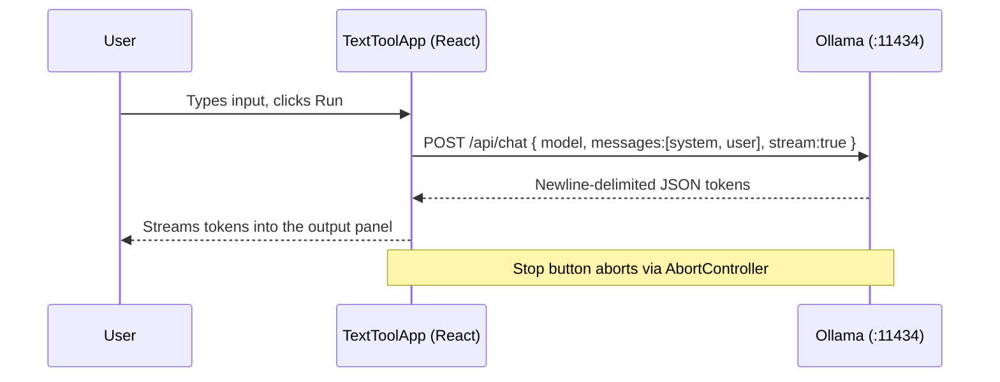

# App Design Documents

Design specifications for the 14 AI mini-apps in the Local Models Playground.
Each document explains **what the app does**, **how AI is used**, the **exact
system prompt**, and the **design rationale**.

## Shared foundation

Every app is a thin configuration of one reusable shell,
[`TextToolApp`](../../frontend/src/components/TextToolApp.tsx). There is **no
custom AI code per app** — the intelligence comes entirely from:

1. A **system prompt** that defines the model's role, output format, and
   guardrails.
2. The **user's input**, sent as a single user message.
3. An optional **control** (dropdown) whose value is interpolated into the
   system prompt to parameterize behavior (e.g. target language, tone, audience).

### How inference works (common to all apps)

- The browser calls Ollama's `/api/chat` **directly** — no backend in between
  (see [ollama.ts](../../frontend/src/data/ollama.ts)).
- Messages are always exactly two: `{ role: 'system', content: <prompt> }` and
  `{ role: 'user', content: <input> }`.
- Responses **stream** token-by-token; users can **stop** mid-generation.
- The **model is user-selectable** at runtime from any model installed in
  Ollama; the default is `qwen2.5:0.5b`.
- **Privacy:** all inference is local. No input or output leaves the machine.

### Why this design

- **Prompt-as-product:** each app's behavior is defined declaratively by a
  prompt, so new apps need no new AI plumbing and are trivial to audit.
- **Determinism of shape, not content:** prompts pin down *output format*
  (bullets, JSON, cents summing to 100) to keep small models on-task.
- **Guardrails in the prompt:** constraints like "output only the translation"
  or "not financial advice" live in the system prompt where the model sees them.

---

## Index

| App | Design doc | AI technique |
|---|---|---|
| Summarizer | [summarizer.md](summarizer.md) | Extractive/abstractive summarization, anti-hallucination |
| Translator | [translator.md](translator.md) | Parameterized translation |
| Code Reviewer | [code-reviewer.md](code-reviewer.md) | Persona + structured critique |
| Data Extractor | [data-extractor.md](data-extractor.md) | Constrained JSON extraction |
| Email Writer | [email-writer.md](email-writer.md) | Parameterized generation (tone) |
| Proofreader | [proofreader.md](proofreader.md) | Constrained rewriting |
| Tone Rewriter | [tone-rewriter.md](tone-rewriter.md) | Parameterized rewriting (style) |
| Brainstormer | [brainstormer.md](brainstormer.md) | Divergent ideation |
| Explainer | [explainer.md](explainer.md) | Audience-adaptive explanation |
| SQL Generator | [sql-generator.md](sql-generator.md) | Natural language → code |
| JSON Builder | [json-builder.md](json-builder.md) | Schema synthesis |
| Azure Architecture Advisor | [azure-architecture.md](azure-architecture.md) | Framework-guided assessment |
| Polymarket Analyst | [polymarket.md](polymarket.md) | Probabilistic estimation |
| Kalshi Analyst | [kalshi.md](kalshi.md) | Probabilistic estimation |
